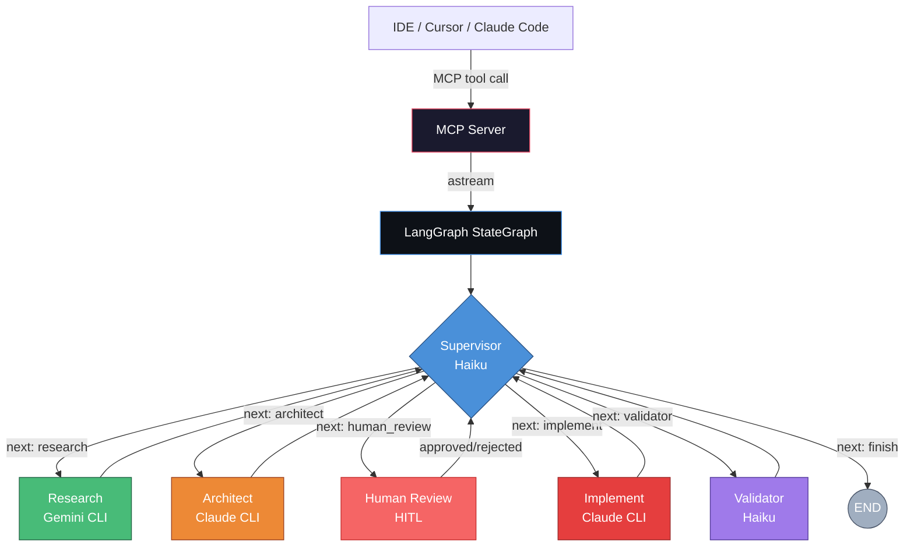
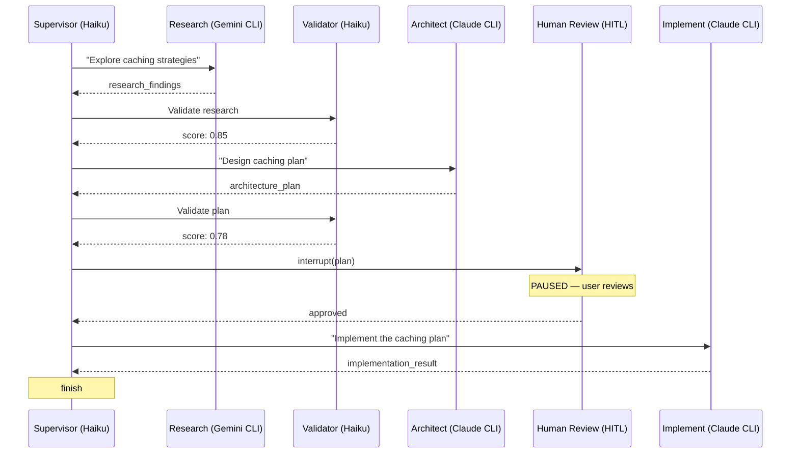
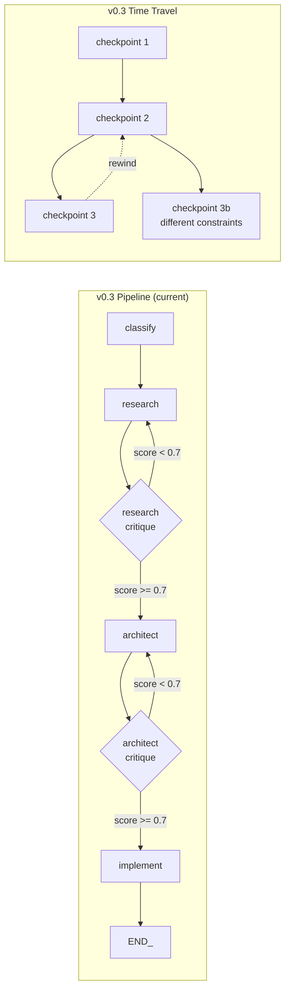

# AI Orchestrator

LangGraph-powered agent that routes tasks to the right AI model, with full codebase access via CLI subprocesses.

| Role | Model | How it runs | When to use |
|---|---|---|---|
| **Research** | Gemini Pro | Gemini CLI subprocess | Domain exploration, technology investigation, understanding unknowns |
| **Architect** | Claude Sonnet | Claude Code CLI subprocess | Design decisions, implementation plans, multi-file coordination |
| **Implement** | Claude Sonnet | Claude Code CLI subprocess | Clear spec exists, ready to write code |
| **Supervisor** | Claude Haiku | LangChain API call | Routing decisions — inspects state and picks the next node |
| **Validator** | Claude Haiku | LangChain API call | Quality scoring — scores output 0.0-1.0 |

## Architecture

The orchestrator is a **LangGraph StateGraph** with a **hub-and-spoke supervisor pattern**, exposed via an **MCP server**. A central supervisor node inspects the full state after every step and dynamically decides what to do next. Domain nodes shell out to CLI tools (Claude Code, Gemini CLI) for native codebase access.



v0.5 features: fan-out parallel research via `Send()`, human-in-the-loop approval before implementation, streaming progress updates, output versioning for timeline comparison, checkpoints and time-travel.

### Why CLI subprocesses?

Each domain node shells out to a CLI tool (`claude -p "..."`, Gemini CLI) from the project root. The CLI tools have built-in codebase indexing, search heuristics, and context management — far richer than a ReAct agent discovering files one tool call at a time. The supervisor and validator use cheap API calls (Haiku) for fast routing decisions.

## How it works

### State

All nodes share a single `OrchestratorState` (TypedDict with `total=False`) that accumulates context:

```python
class OrchestratorState(TypedDict, total=False):
    # Input
    task: str
    context: str

    # Domain outputs — latest (last-writer-wins)
    research_findings: str
    architecture_plan: str
    implementation_result: str

    # Output versioning — append reducer (accumulates across attempts/timelines)
    output_versions: Annotated[list[dict[str, Any]], operator.add]

    # Supervisor routing
    next_node: str
    supervisor_rationale: str
    supervisor_instructions: str
    history: list[str]           # Step-by-step audit trail
    node_calls: dict[str, int]   # Call counts per node

    # Fan-out (parallel research)
    parallel_tasks: list[dict[str, str]]  # Sub-tasks for Send()
    parallel_task_topic: str              # Topic label per branch

    # Human-in-the-loop
    human_review_status: str     # "approved" or "rejected"
    human_feedback: str

    # Validation
    validation_score: float      # 0.0-1.0 quality score
    validation_feedback: str
```

**Reducer strategy:** `output_versions` uses `operator.add` (append), `messages` uses `add_messages` (accumulate), everything else is last-writer-wins.

### Nodes

Each node is a factory function that returns an async handler. Domain nodes shell out to CLI subprocesses:

```python
def build_research_node():
    async def research_node(state: OrchestratorState) -> dict:
        task = state.get("task", "")
        instructions = state.get("supervisor_instructions", "")
        topic = state.get("parallel_task_topic", "")

        # Parallel sub-task: prepend topic context
        if topic:
            instructions = f"[Research sub-task: {topic}]\n\n{instructions}"

        prompt = build_prompt(RESEARCH_SYSTEM_PROMPT, task, ...)
        findings = await run_gemini(prompt, timeout=600)

        return {
            "research_findings": findings,
            "output_versions": [{"node": "research", "attempt": N, "topic": label, "content": findings}],
            "history": history + [f"research: completed (topic: {label})"],
        }
    return research_node
```

The supervisor uses Pydantic structured output for type-safe routing decisions:

```python
class RouterDecision(BaseModel):
    next_step: Literal["research", "architect", "human_review", "implement", "validator", "finish"]
    rationale: str
    instructions: str
    parallel_tasks: list[ParallelTask] = Field(default_factory=list)
```

### Graph construction

```python
def build_orchestrator_graph(config):
    graph = StateGraph(OrchestratorState)

    # 7 nodes: supervisor, research, architect, implement, validator, merge_research, human_review
    graph.add_node("supervisor", supervisor_node)
    graph.add_node("research", research_node)
    graph.add_node("architect", architect_node)
    graph.add_node("implement", implement_node)
    graph.add_node("validator", validator_node)
    graph.add_node("merge_research", _merge_research_node)
    graph.add_node("human_review", human_review_node)

    # Entry → supervisor (supervisor always makes the first decision)
    graph.add_edge(START, "supervisor")

    # Supervisor routes dynamically (may return Send() list for fan-out)
    graph.add_conditional_edges("supervisor", select_next_node, {
        "research": "research", "architect": "architect",
        "human_review": "human_review", "implement": "implement",
        "validator": "validator", END: END,
    })

    # Research → merge (fan-out) or supervisor (sequential)
    graph.add_conditional_edges("research", _research_exit, {
        "merge_research": "merge_research", "supervisor": "supervisor",
    })

    # All other nodes return to supervisor
    graph.add_edge("merge_research", "supervisor")
    graph.add_edge("human_review", "supervisor")
    graph.add_edge("architect", "supervisor")
    graph.add_edge("implement", "supervisor")
    graph.add_edge("validator", "supervisor")

    return graph.compile(checkpointer=InMemorySaver())
```

### Graph flow



## MCP tools

The server exposes 7 tools — 3 direct (bypass the graph) and 4 graph tools:

### Direct tools

| Tool | What it does |
|------|-------------|
| `research(question, context?)` | Gemini CLI research — bypasses the graph |
| `architect(goal, context?, constraints?)` | Claude CLI architecture — bypasses the graph |
| `classify(task_description)` | Fast tier classification via API (Haiku) |

### Graph tools

| Tool | What it does |
|------|-------------|
| `chain(task_description, context?, thread_id?)` | Full pipeline with streaming progress — pauses for human approval |
| `approve(thread_id, feedback?)` | Resume a paused chain — approve or reject with feedback |
| `history(thread_id, limit?)` | Show checkpoint history — supervisor decisions, scores, state |
| `rewind(thread_id, checkpoint_id, new_task?)` | Time-travel — rewind to a checkpoint and re-run |

### chain() with streaming

`chain()` uses `graph.astream(stream_mode="updates")` and sends real-time MCP progress notifications after each node completes:

```python
@mcp.tool()
async def chain(task_description: str, ctx: Context, context: str = "", thread_id: str = "") -> str:
    async for update in graph.astream(initial_state, config=graph_config, stream_mode="updates"):
        for node_name, state_update in update.items():
            message = _build_progress_message(node_name, state_update)
            await ctx.report_progress(step, message=message)
```

| Node | Progress message example |
|------|------------------------|
| supervisor | `Supervisor -> research: Need to explore caching options [fan-out: redis, memcached]` |
| validator | `Validator: score 0.85` |
| research | `Research completed: redis` |
| architect | `Architect: plan ready` |
| implement | `Implementation completed` |
| human_review | `Human review: approved` |

### Human-in-the-loop

The pipeline **pauses for human approval** before implementation:

1. Supervisor routes to `human_review` after the architecture plan is validated
2. `human_review` node calls `interrupt(review_payload)` — graph pauses
3. `chain()` returns the plan with approval instructions and the `thread_id`
4. User calls `approve(thread_id)` to continue, or `approve(thread_id, feedback="...")` to reject
5. If rejected, supervisor sends the architect back to revise with your feedback

## Setup

### 1. Install

```bash
git clone <this-repo>
cd ai-orchestrator
uv sync
```

### 2. Configure API keys

```bash
cp .env.example .env
# Edit .env with your API keys:
#   ANTHROPIC_API_KEY=sk-ant-...
#   GOOGLE_AI_API_KEY=AIza...
```

### 3. Connect to Cursor (Option A — CLI server, recommended)

Add to `~/.cursor/mcp.json` (global) or `.cursor/mcp.json` (project-level):

```json
{
  "mcpServers": {
    "ai-orchestrator": {
      "command": "uv",
      "args": [
        "--directory",
        "/home/_3ntropy/dev/ai-orchestrator",
        "run",
        "ai-orchestrator"
      ]
    }
  }
}
```

This connects Cursor to the CLI server (Option A) which delegates to Claude Code (`claude -p`) and Gemini CLI (`npx @google/gemini-cli@latest`). No API keys needed — each CLI handles its own auth.

### 4. Connect to Cursor (LangGraph server, experimental)

To use the LangGraph pipeline (Option B) instead, swap the entry point and provide API keys:

```json
{
  "mcpServers": {
    "ai-orchestrator": {
      "command": "uv",
      "args": [
        "--directory",
        "/home/_3ntropy/dev/ai-orchestrator",
        "run",
        "ai-orchestrator-graph"
      ],
      "env": {
        "ANTHROPIC_API_KEY": "sk-ant-...",
        "GOOGLE_AI_API_KEY": "AIza..."
      }
    }
  }
}
```

### 5. Connect to Claude Code

Add to `~/.claude.json` under `mcpServers`:

```json
{
  "mcpServers": {
    "ai-orchestrator": {
      "command": "uv",
      "args": [
        "--directory",
        "/home/_3ntropy/dev/ai-orchestrator",
        "run",
        "ai-orchestrator"
      ]
    }
  }
}
```

## Tool examples

```
# Direct research (bypasses graph)
research("How do confidence-gated HITL pipelines work in LangGraph?")

# Direct architecture (bypasses graph)
architect("Add WebSocket notifications", constraints="Must work with FastAPI")

# Fast classification
classify("Fix the typo in the dashboard header")
# → Tier: implement (confidence: 95%) — Pipeline: implement

# Full pipeline — streams progress, pauses for approval
chain("Add caching to the API routes")
# → Supervisor → research → validator → architect → validator → human_review (PAUSED)
# Returns plan + thread_id for approval

# Approve and continue to implementation
approve(thread_id="abc-123")

# Or reject with feedback
approve(thread_id="abc-123", feedback="Use Redis instead of Memcached")

# View checkpoint history
history(thread_id="abc-123")

# Rewind to a checkpoint and retry with different constraints
rewind(thread_id="abc-123", checkpoint_id="ckpt-456", new_task="Add caching but keep backward compat")
```

## Configuration

Edit `config.yaml` to change models, providers, or add new roles. Defaults are baked in if no config file exists:

```yaml
roles:
  research:
    provider: google
    model: gemini-2.0-pro
  architect:
    provider: anthropic
    model: claude-sonnet-4-20250514
  classify:
    provider: anthropic
    model: claude-haiku-4-5-20251001
    max_tokens: 256
```

The **supervisor** and **validator** nodes both use the classify model (Haiku) — cheap and fast for routing decisions and quality scoring. Domain nodes (research, architect, implement) use CLI subprocesses.

## Project structure

```
ai-orchestrator/
├── src/orchestrator/
│   ├── __init__.py            # Package marker
│   ├── server.py              # MCP server — 7 tools, streaming, HITL approve/reject
│   ├── graph.py               # StateGraph construction — hub-and-spoke + fan-out
│   ├── state.py               # OrchestratorState TypedDict with reducers
│   ├── config.py              # YAML config loader with sensible defaults
│   ├── models.py              # LangChain model factories from config
│   ├── router.py              # Role → provider resolution (used by direct tools)
│   ├── nodes/
│   │   ├── __init__.py        # Exports build_*_node() factories
│   │   ├── supervisor.py      # Central decision-maker (Pydantic structured output)
│   │   ├── validator.py       # Quality scoring (0.0-1.0) on research/architecture
│   │   ├── research.py        # Gemini CLI — sequential or parallel via Send()
│   │   ├── architect.py       # Claude CLI — design/planning with self-correction
│   │   ├── implement.py       # Claude CLI — code implementation
│   │   ├── human_review.py    # HITL — pauses graph via interrupt() for approval
│   │   ├── classify.py        # Classifier node (legacy, used by direct tools)
│   │   └── critique.py        # Self-reflection critique nodes (legacy)
│   ├── cli_server_pkg/        # Shared CLI subprocess utilities
│   │   ├── session/runners.py # run_claude() and run_gemini() wrappers
│   │   └── helpers/prompts.py # build_prompt() utility
│   ├── providers/             # API provider classes (used by direct tools)
│   └── prompts/               # System prompts for research, architect, classifier
├── docs/
│   ├── langgraph-architecture.md  # Architecture guide with Mermaid diagrams
│   ├── langgraph-study-guide.md   # Deep-dive study guide (15 sections)
│   └── langgraph-patterns.md      # 9 graph patterns reference
├── config.yaml                # Model and role config (optional — has defaults)
├── pyproject.toml             # uv project config
└── .env                       # API keys (ANTHROPIC_API_KEY, GOOGLE_AI_API_KEY)
```

## Roadmap

### v0.2 — LangGraph migration (done)

- [x] Add `langgraph`, `langchain-core`, `langchain-anthropic`, `langchain-google-genai` dependencies
- [x] Create `state.py` with `OrchestratorState` TypedDict (`add_messages` reducer)
- [x] Create `tools/filesystem.py` with `read_file`, `glob_files`, `grep_content`, `list_dir`, `write_file`
- [x] Create `models.py` — LangChain model factories reading from `OrchestratorConfig`
- [x] Create node factories in `nodes/` (classify, research, architect, implement placeholder)
- [x] Create `graph.py` with `build_orchestrator_graph()` — StateGraph with conditional routing
- [x] Update `server.py` — `chain()` invokes LangGraph graph, direct tools unchanged
- [x] Lazy graph construction — no API keys required at import time

**Two execution paths**: Direct tools (`research()`, `architect()`, `classify()`) still use the `Router` + raw providers for fast, cheap calls. The `chain()` tool uses the LangGraph graph internally with filesystem tools.

### v0.3 — Agent intelligence (done)

Self-reflection, self-correction, checkpoints, and time-travel.

- [x] **Checkpoints** — `InMemorySaver` with `thread_id` support. Multi-turn chains accumulate context across calls.
- [x] **Time-travel / revert** — `history(thread_id)` shows all checkpoints. `rewind(thread_id, checkpoint_id)` replays from any point with optional new task.
- [x] **Self-reflection** — Critique nodes (Haiku) score research/architect output 0.0-1.0. Loops back with feedback if score < 0.7 (max 2 attempts).
- [x] **Self-correction** — Architect node validates file paths and function names against the actual codebase before finalizing.
- [x] **Implement node** — Claude Code CLI with full read/write codebase access. No longer a placeholder.
- [x] **CLI subprocess migration** — Research, architect, and implement nodes use `run_gemini`/`run_claude` (shared with Option A) instead of API + ReAct agents.



**New MCP tools (Option B)**: `chain(task, context?, thread_id?)`, `history(thread_id)`, `rewind(thread_id, checkpoint_id, new_task?)`

### v0.4 — Dynamic Supervisor (done)

Hub-and-spoke supervisor pattern replacing the linear pipeline.

- [x] **Supervisor node** — central decision-maker with Pydantic structured output (`RouterDecision`)
- [x] **Dynamic routing** — every node returns to supervisor, which decides what's next (or terminates)
- [x] **Validator node** — scores output quality 0.0-1.0, supervisor retries if score is low
- [x] **Self-healing** — supervisor detects failure and retries with feedback automatically

### v0.5 — Fan-Out, HITL, Streaming (done)

Parallel research, human approval gate, streaming progress, and output versioning.

**Fan-out / Fan-in:**
- [x] `RouterDecision` extended with `parallel_tasks: list[ParallelTask]` (topic + instructions)
- [x] `select_next_node` returns `Send("research", payload)` list when fan-out is requested
- [x] `merge_research` node combines parallel findings into sectioned markdown
- [x] `output_versions` append reducer tracks all parallel branch outputs
- [x] Conditional `_research_exit` edge — fan-out routes to merge, sequential routes to supervisor
- [x] Backward compatible — empty `parallel_tasks` triggers the existing sequential path

**Human-in-the-loop:**
- [x] `human_review` node uses `interrupt()` to pause graph before implementation
- [x] `approve(thread_id, feedback?)` MCP tool resumes with approval or rejection
- [x] Supervisor routes to `human_review` after architecture plan is validated
- [x] Rejection sends architect back to revise with human feedback
- [x] `chain()` detects interrupt and returns plan with approval instructions
- [x] Review status shown in `history()` checkpoints and `_format_graph_result()`

**Streaming:**
- [x] `chain()` and `approve()` use `graph.astream(stream_mode="updates")` for real-time progress
- [x] `_build_progress_message()` formats per-node progress (supervisor decisions, scores, completions)
- [x] `ctx.report_progress()` sends MCP progress notifications to the IDE

### v0.6 — Production features

- [ ] Cost tracking — log token usage per node per request
- [ ] Custom roles — define new nodes in `config.yaml` with custom prompts
- [ ] Streamable HTTP transport — for remote hosting beyond stdio
- [ ] Rate limiting and circuit breakers per provider

---

## Two execution paths

Both options are exposed through the same MCP server with different entry points.

### Option A — CLI server (primary workflow, `ai-orchestrator`)

Cursor/Claude Code calls direct tools (`research`, `architect`, `classify`). Each tool delegates to a CLI subprocess. Simple, fast, no graph overhead. Best for ~95% of tasks.

### Option B — LangGraph pipeline (experimental, `ai-orchestrator-graph`)

The full supervisor-driven pipeline with dynamic routing, fan-out, HITL, streaming, checkpoints, and time-travel. Best for complex tasks that benefit from multi-step coordination.

Both share the same CLI subprocess wrappers (`run_claude`, `run_gemini`) and system prompts.

### CLI tool capabilities

| Tool | Headless mode | Codebase-aware | Role in orchestrator |
|------|--------------|----------------|---------------------|
| **Cursor** | No (IDE only) | Yes (IDE only) | Primary IDE — delegates research and complex tasks via MCP |
| **Claude Code** | `claude -p "..."` | Yes (native) | Architecture and implementation (architect, implement nodes) |
| **Gemini CLI** | `npx @google/gemini-cli` | Yes (native) | Research and exploration (research node) |
