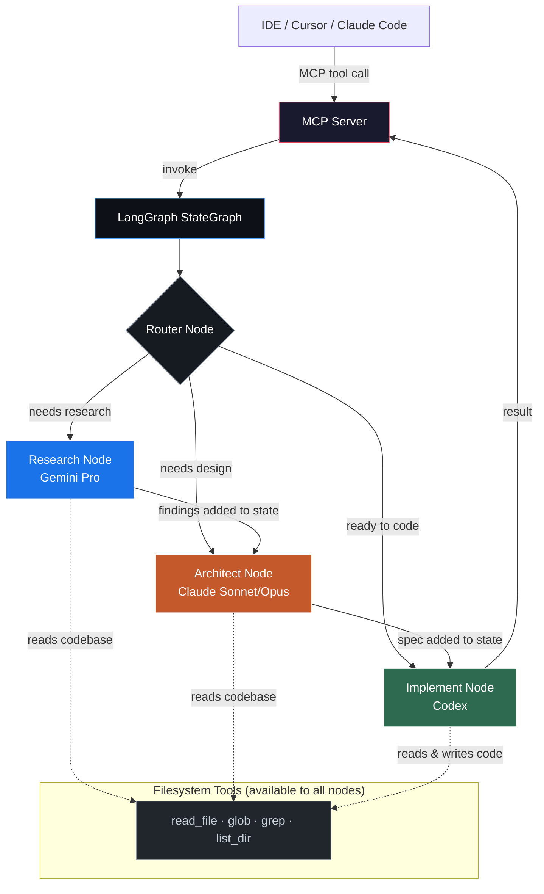
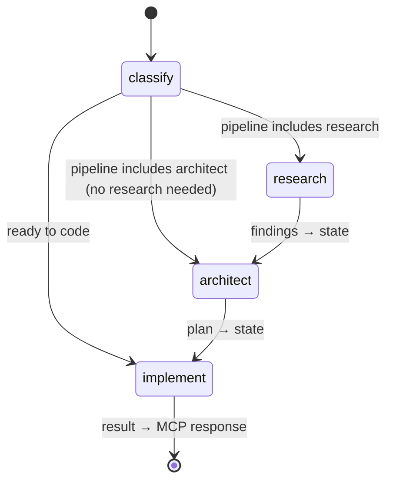
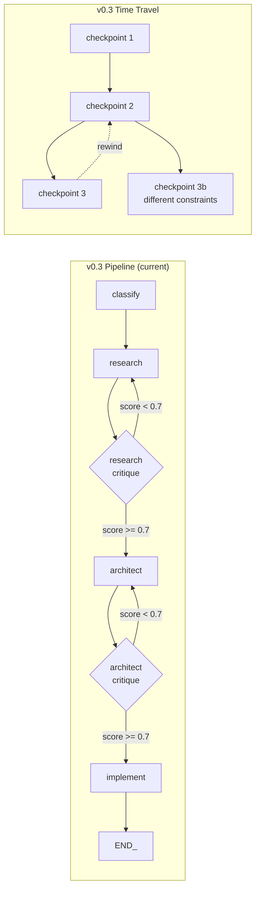
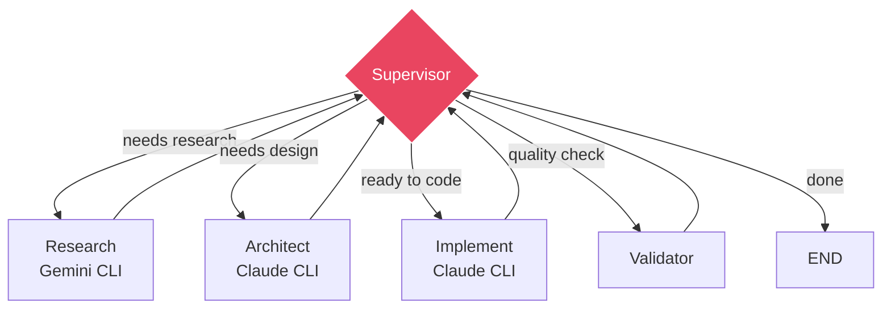
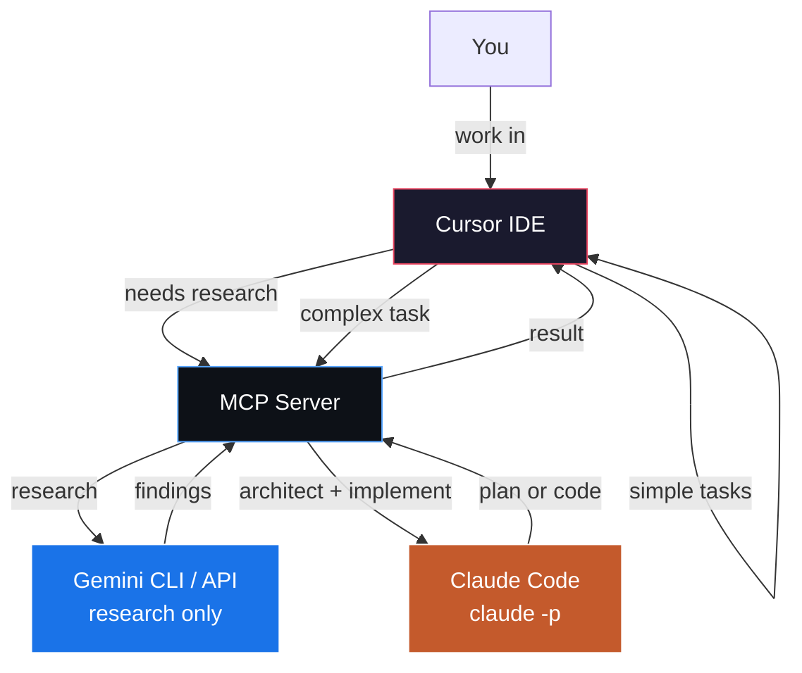
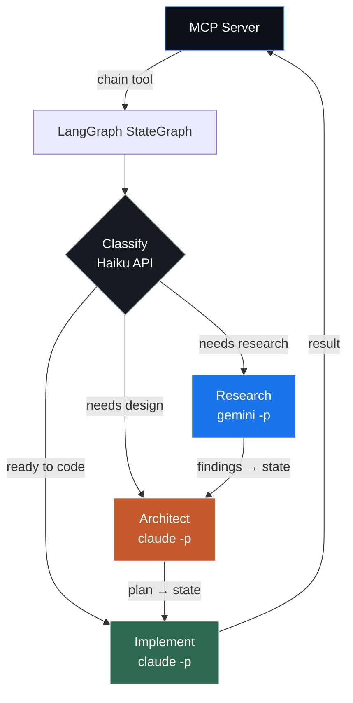

# AI Orchestrator

LangGraph-powered agent that routes tasks to the right AI model, with full filesystem access for codebase-aware reasoning.

| Role | Model | When to use |
|---|---|---|
| **Research** | Gemini Pro | Domain exploration, technology investigation, understanding unknowns |
| **Architect** | Claude Sonnet/Opus | Design decisions, implementation plans, multi-file coordination |
| **Classify** | Claude Haiku | Fast routing — determines which pipeline a task needs |
| **Implement** | Codex / IDE model | Clear spec exists, ready to write code |

## Architecture

The orchestrator is a **LangGraph StateGraph** exposed via an **MCP server**. Each node in the graph is a different AI model with filesystem tools — so every model can read your codebase, not just the one in your IDE.



### Why LangGraph?

The previous version was a simple API router — each model got a prompt string and returned text. The problem: **models had no codebase access**. You had to manually paste file contents into the `context` parameter.

With LangGraph, each node is a ReAct agent with filesystem tools. The research model can `grep` for patterns, the architect can `read_file` to understand existing code, and the implement node can read and write files directly. State flows between nodes, so research findings automatically feed into architecture decisions.

## How it works

### State

All nodes share a single `OrchestratorState` that accumulates context as the graph executes:

```python
from typing import TypedDict, Annotated
from langgraph.graph import add_messages
from langchain_core.messages import AnyMessage

class OrchestratorState(TypedDict):
    """Shared state flowing through the orchestrator graph."""
    # The original task description from the user
    task: str
    # Optional user-provided context (file contents, constraints, etc.)
    context: str
    # Classification result — which pipeline to run
    classification: dict  # {tier, confidence, reasoning, pipeline}
    # Accumulated messages from each node's agent execution
    messages: Annotated[list[AnyMessage], add_messages]
    # Research findings (populated by research node)
    research_findings: str
    # Architecture plan (populated by architect node)
    architecture_plan: str
    # Implementation result (populated by implement node)
    implementation_result: str
```

### Nodes

Each node is a factory function that returns an async handler. This pattern (closure over dependencies) keeps nodes testable and configurable:

```python
def make_research_node(model, tools):
    """Create the research node — Gemini Pro with filesystem tools."""
    agent = create_react_agent(model, tools, prompt=RESEARCH_SYSTEM_PROMPT)

    async def research_node(state: OrchestratorState) -> dict:
        result = await agent.ainvoke({"messages": [HumanMessage(content=state["task"])]})
        findings = result["messages"][-1].content
        return {
            "research_findings": findings,
            "messages": result["messages"],
        }

    return research_node
```

The same pattern applies to the architect and implement nodes — each gets a model and tools, returns a state update dict.

### Routing

A lightweight router function reads the classification and decides which nodes to visit:

```python
def route_after_classify(state: OrchestratorState) -> Literal["research", "architect", "implement"]:
    """Conditional edge — pick the next node based on classification."""
    pipeline = state["classification"].get("pipeline", ["architect"])
    if "research" in pipeline:
        return "research"
    elif "architect" in pipeline:
        return "architect"
    return "implement"
```

### Graph construction

```python
from langgraph.graph import StateGraph, START, END

def build_orchestrator_graph(config):
    """Build the full orchestrator graph."""
    # Initialize models and tools
    tools = [read_file, glob_files, grep_content, list_dir]

    graph = StateGraph(OrchestratorState)

    # Add nodes
    graph.add_node("classify", make_classify_node(haiku_model))
    graph.add_node("research", make_research_node(gemini_model, tools))
    graph.add_node("architect", make_architect_node(claude_model, tools))
    graph.add_node("implement", make_implement_node(codex_model, tools))

    # Edges
    graph.add_edge(START, "classify")
    graph.add_conditional_edges("classify", route_after_classify)
    graph.add_edge("research", "architect")
    graph.add_edge("architect", "implement")
    graph.add_edge("implement", END)

    return graph.compile()
```

### Graph flow



### Filesystem tools

Every node gets these tools so it can reason about your actual codebase:

| Tool | Description |
|---|---|
| `read_file(path)` | Read a file's contents |
| `glob_files(pattern, directory?)` | Find files matching a glob pattern |
| `grep_content(pattern, path?, file_type?)` | Search file contents with regex |
| `list_dir(path)` | List directory contents |
| `write_file(path, content)` | Write content to a file (implement node only) |

Tools are bound to nodes using the closure pattern:

```python
from langchain_core.tools import tool

@tool
def read_file(path: str) -> str:
    """Read a file and return its contents."""
    with open(path) as f:
        return f.read()

@tool
def glob_files(pattern: str, directory: str = ".") -> list[str]:
    """Find files matching a glob pattern."""
    from pathlib import Path
    return [str(p) for p in Path(directory).glob(pattern)]
```

## MCP integration

The MCP server is the external interface — your IDE calls MCP tools, which internally invoke the LangGraph graph:

```python
from mcp.server.fastmcp import FastMCP

mcp = FastMCP("ai-orchestrator")
graph = build_orchestrator_graph(config)

@mcp.tool()
async def chain(task_description: str, context: str = "") -> str:
    """Auto-route a task through the full pipeline."""
    result = await graph.ainvoke({
        "task": task_description,
        "context": context,
        "messages": [],
    })
    return format_result(result)
```

The individual `research()`, `architect()`, and `classify()` tools still exist for when you want to call a specific model directly.

## Setup

### 1. Install

```bash
git clone <this-repo>
cd ai-orchestrator
uv sync
```

### 2. Configure API keys

```bash
cp .env.example .env
# Edit .env with your API keys:
#   ANTHROPIC_API_KEY=sk-ant-...
#   GOOGLE_AI_API_KEY=AIza...
#   OPENAI_API_KEY=sk-...        (for Codex implement node)
```

### 3. Connect to Cursor (Option A — CLI server, recommended)

Add to `~/.cursor/mcp.json` (global) or `.cursor/mcp.json` (project-level):

```json
{
  "mcpServers": {
    "ai-orchestrator": {
      "command": "uv",
      "args": [
        "--directory",
        "/home/_3ntropy/dev/ai-orchestrator",
        "run",
        "ai-orchestrator"
      ]
    }
  }
}
```

This connects Cursor to the CLI server (Option A) which delegates to Claude Code (`claude -p`) and Gemini CLI (`npx @google/gemini-cli@latest`). No API keys needed — each CLI handles its own auth.

### 4. Connect to Cursor (LangGraph server, experimental)

To use the LangGraph pipeline (Option B) instead, swap the entry point and provide API keys:

```json
{
  "mcpServers": {
    "ai-orchestrator": {
      "command": "uv",
      "args": [
        "--directory",
        "/home/_3ntropy/dev/ai-orchestrator",
        "run",
        "ai-orchestrator-graph"
      ],
      "env": {
        "ANTHROPIC_API_KEY": "sk-ant-...",
        "GOOGLE_AI_API_KEY": "AIza..."
      }
    }
  }
}
```

### 5. Connect to Claude Code

Add to `~/.claude.json` under `mcpServers`:

```json
{
  "mcpServers": {
    "ai-orchestrator": {
      "command": "uv",
      "args": [
        "--directory",
        "/home/_3ntropy/dev/ai-orchestrator",
        "run",
        "ai-orchestrator"
      ]
    }
  }
}
```

## Tools

### `research(question, context?)`

Deep research using Gemini with filesystem access. The model can read your codebase to ground its research.

```
research("How do confidence-gated HITL pipelines work in LangGraph?")
```

### `architect(goal, context?, constraints?)`

Design an implementation plan using Claude. Reads relevant files to understand existing patterns before planning.

```
architect(
  "Add real-time WebSocket notifications for task status changes",
  constraints="Must work with existing FastAPI backend and RTK Query frontend"
)
```

### `classify(task_description)`

Fast classification — tells you which tier a task falls into and the recommended pipeline.

```
classify("Fix the typo in the dashboard header")
# → Tier: implement (confidence: 95%)
# → Pipeline: implement

classify("Add vector search to the dashboard AI chat")
# → Tier: architect (confidence: 88%)
# → Pipeline: architect → implement

classify("How does the fabrication pipeline work end to end?")
# → Tier: research (confidence: 92%)
# → Pipeline: research → architect → implement
```

### `chain(task_description, context?)`

Auto-routes through the full LangGraph pipeline. Classifies, researches if needed, architects if needed, implements if needed. Each step has full filesystem access.

```
chain("Implement a retry mechanism for failed source extractions")
# 1. Classifies → architect
# 2. Skips research (domain is understood)
# 3. Architect reads existing extraction code, designs retry strategy
# 4. Returns implementation plan with file-specific changes
```

## Configuration

Edit `config.yaml` to change models, providers, or add new roles:

```yaml
roles:
  research:
    provider: google
    model: gemini-2.0-pro          # swap models here
    max_tokens: 8192
  architect:
    provider: anthropic
    model: claude-sonnet-4-20250514  # or claude-opus-4-6
    max_tokens: 4096
  classify:
    provider: anthropic
    model: claude-haiku-4-5-20251001
    max_tokens: 256
  implement:
    provider: openai
    model: codex-mini               # or gpt-4o
    max_tokens: 8192
```

## Project structure

```
ai-orchestrator/
├── src/orchestrator/
│   ├── __init__.py            # Package marker
│   ├── server.py              # MCP server — exposes tools, chain() invokes graph
│   ├── router.py              # Routes roles → providers (used by direct tools)
│   ├── config.py              # Loads config.yaml
│   ├── models.py              # LangChain model factories from config
│   ├── state.py               # OrchestratorState TypedDict
│   ├── graph.py               # StateGraph construction and compilation
│   ├── nodes/
│   │   ├── __init__.py        # Exports build_*_node() factories
│   │   ├── classify.py        # Classifier node (Haiku — fast routing)
│   │   ├── research.py        # Research node (Gemini — ReAct agent)
│   │   ├── architect.py       # Architect node (Claude — ReAct agent)
│   │   ├── implement.py       # Implement node (Claude Code CLI)
│   │   └── critique.py       # Self-reflection critique nodes (Haiku)
│   ├── tools/
│   │   ├── __init__.py        # Exports READ_TOOLS, WRITE_TOOLS
│   │   └── filesystem.py      # read_file, glob, grep, list_dir, write_file
│   ├── providers/
│   │   ├── __init__.py        # Exports Provider classes
│   │   ├── base.py            # Provider interface (used by direct tools)
│   │   ├── anthropic_provider.py
│   │   └── google_provider.py
│   └── prompts/
│       ├── __init__.py        # Exports system prompts
│       ├── research.py        # Gemini system prompt
│       ├── architect.py       # Claude system prompt
│       └── classifier.py      # Haiku classifier prompt
├── config.yaml                # Model and role config
├── pyproject.toml             # uv project config
└── .env.example               # API key template
```

## Roadmap

### v0.2 — LangGraph migration (done)

- [x] Add `langgraph`, `langchain-core`, `langchain-anthropic`, `langchain-google-genai` dependencies
- [x] Create `state.py` with `OrchestratorState` TypedDict (`add_messages` reducer)
- [x] Create `tools/filesystem.py` with `read_file`, `glob_files`, `grep_content`, `list_dir`, `write_file`
- [x] Create `models.py` — LangChain model factories reading from `OrchestratorConfig`
- [x] Create node factories in `nodes/` (classify, research, architect, implement placeholder)
- [x] Create `graph.py` with `build_orchestrator_graph()` — StateGraph with conditional routing
- [x] Update `server.py` — `chain()` invokes LangGraph graph, direct tools unchanged
- [x] Lazy graph construction — no API keys required at import time

**Two execution paths**: Direct tools (`research()`, `architect()`, `classify()`) still use the `Router` + raw providers for fast, cheap calls. The `chain()` tool uses the LangGraph graph internally with filesystem tools.

### v0.3 — Agent intelligence (done)

Self-reflection, self-correction, checkpoints, and time-travel.

- [x] **Checkpoints** — `InMemorySaver` with `thread_id` support. Multi-turn chains accumulate context across calls.
- [x] **Time-travel / revert** — `history(thread_id)` shows all checkpoints. `rewind(thread_id, checkpoint_id)` replays from any point with optional new task.
- [x] **Self-reflection** — Critique nodes (Haiku) score research/architect output 0.0-1.0. Loops back with feedback if score < 0.7 (max 2 attempts).
- [x] **Self-correction** — Architect node validates file paths and function names against the actual codebase before finalizing.
- [x] **Implement node** — Claude Code CLI with full read/write codebase access. No longer a placeholder.
- [x] **CLI subprocess migration** — Research, architect, and implement nodes use `run_gemini`/`run_claude` (shared with Option A) instead of API + ReAct agents.



**New MCP tools (Option B)**: `chain(task, context?, thread_id?)`, `history(thread_id)`, `rewind(thread_id, checkpoint_id, new_task?)`

### v0.4 — Dynamic Supervisor

Replace the linear pipeline with a hub-and-spoke supervisor pattern. Instead of a one-shot classifier routing to a predetermined path, a recurring supervisor inspects the full state after every node and dynamically decides what to do next.

| Feature | How it fits | Complexity |
|---|---|---|
| **Supervisor node** | Central decision-maker that runs after every node. Inspects full state (history, scores, findings) and picks the next node or terminates. Uses structured output (Pydantic `RouterDecision`). | Medium |
| **Dynamic routing** | Every node returns to the supervisor. It can skip nodes, reorder them, call the same node twice with different instructions, or terminate early. The flow is fully LLM-driven, not hardcoded. | Medium |
| **Self-healing** | When a node fails or scores low, the supervisor uses `update_state()` to fork the graph history, inject a hint at a past checkpoint, and re-run from there — automatically, not via manual `rewind()`. | Hard |
| **Pydantic RouterDecision** | Structured output schema: `next_step` (which node), `rationale` (why), `instructions` (what to tell the node). Type-safe, validated, extensible. | Low |



The supervisor replaces both `classify` and the critique nodes — it handles routing, quality assessment, and retry logic in one place. Adding new nodes only requires updating the `RouterDecision` literal and the conditional edge map.

### v0.5 — Production features

- [ ] Cost tracking — log token usage per node per request
- [ ] Streaming — `astream(stream_mode=["messages", "updates"])` for real-time output
- [ ] Custom roles — define new nodes in `config.yaml` with custom prompts
- [ ] Streamable HTTP transport — for remote hosting beyond stdio
- [ ] Rate limiting and circuit breakers per provider

---

## Future direction: CLI-native orchestration

The current architecture gives models codebase access through custom filesystem tools (read_file, glob, grep). This works, but CLI tools like Claude Code and Gemini CLI provide **much richer codebase context natively** — they have built-in indexing, search heuristics, and context management that a ReAct agent discovering files one tool call at a time can't match.

Two planned approaches address this, both exposed through the same MCP server:

### Option A — Cursor as orchestrator (primary workflow)

Cursor is the primary IDE and handles implementation for ~95% of tasks. The MCP server gives Cursor access to two additional models for the cases where it needs help:

- **Gemini** for research — deep domain exploration, technology investigation, understanding unknowns. Gemini has strong research skills but is weak at writing code.
- **Claude Code** for complex implementation — multi-file coordination, intricate refactors, tasks where Cursor's built-in models struggle. Claude Code runs headlessly via `claude -p` with full codebase access.



**The workflow**:
1. You work in Cursor as usual. It handles most tasks directly.
2. When you need research on a topic/technology, Cursor calls `research()` → Gemini explores and returns findings.
3. When a task is too complex for Cursor's models, Cursor calls `architect()` or `implement()` → Claude Code takes over with full codebase context, returns a plan or writes code directly.

**Why this split**: Each model does what it's best at. Cursor is fast and handles the majority of day-to-day coding. Gemini is strong at research and exploration but shouldn't be writing code. Claude Code is the heavy hitter for complex architecture and implementation that Cursor can't handle alone.

**What to build**:
- [ ] Gemini CLI subprocess wrapper — async provider that calls `gemini -p "..."` with `cwd` set to the project root
- [ ] Claude Code subprocess wrapper — async provider that calls `claude -p "..."` with codebase access
- [ ] MCP server with `research(question)` → Gemini and `architect(goal)` / `implement(spec)` → Claude Code
- [ ] Fallback to API providers when CLIs aren't installed

### Option B — LangGraph with CLI subprocesses (experimental)

Keep the full LangGraph pipeline for experimenting with multi-agent coordination, but swap the ReAct agents (API + custom filesystem tools) for CLI subprocess calls. Each model gets native codebase access instead of discovering files one tool call at a time.



Each node shells out to a CLI tool (`claude -p "..."`, `gemini -p "..."`) from the project directory so they inherit full codebase context automatically. LangGraph handles routing, state accumulation, and coordination. The custom filesystem tools become unnecessary.

**What to build**:
- [ ] CLI subprocess provider — async wrapper around `claude -p` and `gemini -p`
- [ ] Rewire research node to use `gemini -p` subprocess
- [ ] Rewire architect node to use `claude -p` subprocess
- [ ] Implement node using `claude -p` with write permissions
- [ ] Fallback to API providers when CLIs aren't installed
- [ ] Remove custom filesystem tools once CLI nodes are stable

**Why keep LangGraph**: This is the testbed for advanced agent patterns — self-reflection loops, checkpoints, time-travel, critique nodes. The graph adds value when experimenting with *how agents coordinate*, not just calling individual models.

### CLI tool capabilities

| Tool | Headless mode | Codebase-aware | Role in orchestrator |
|------|--------------|----------------|---------------------|
| **Cursor** | No (IDE only) | Yes (IDE only) | Orchestrator — handles ~95% of tasks directly, delegates research and complex tasks via MCP |
| **Claude Code** | `claude -p "..."` | Yes (native) | Complex architecture and implementation — the fallback when Cursor's models aren't enough |
| **Gemini CLI** | `gemini -p "..."` | Yes (native) | Research only — strong at exploration, weak at writing code |
