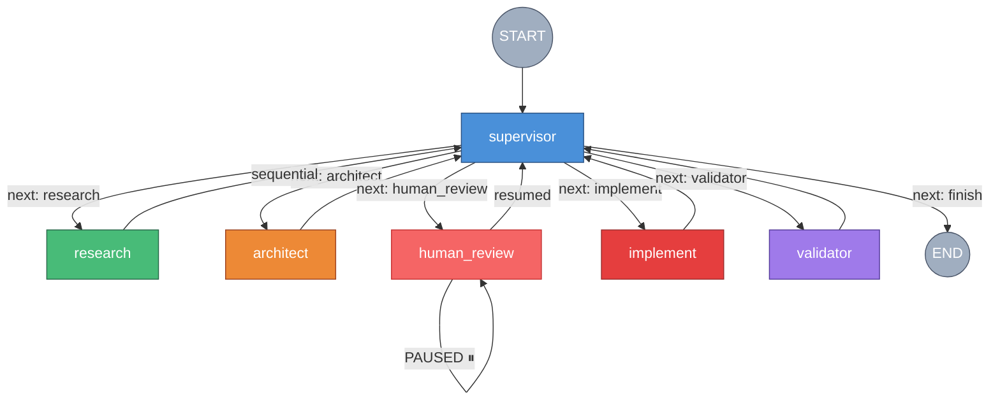
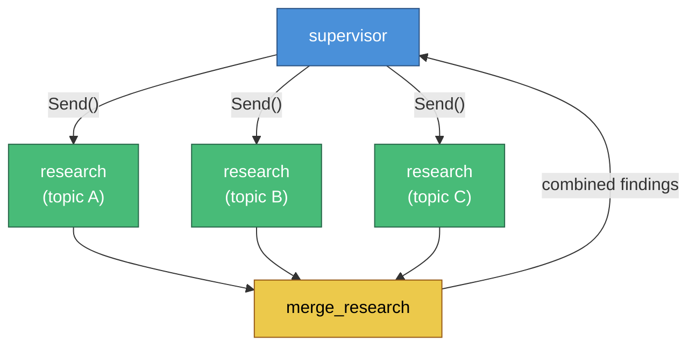
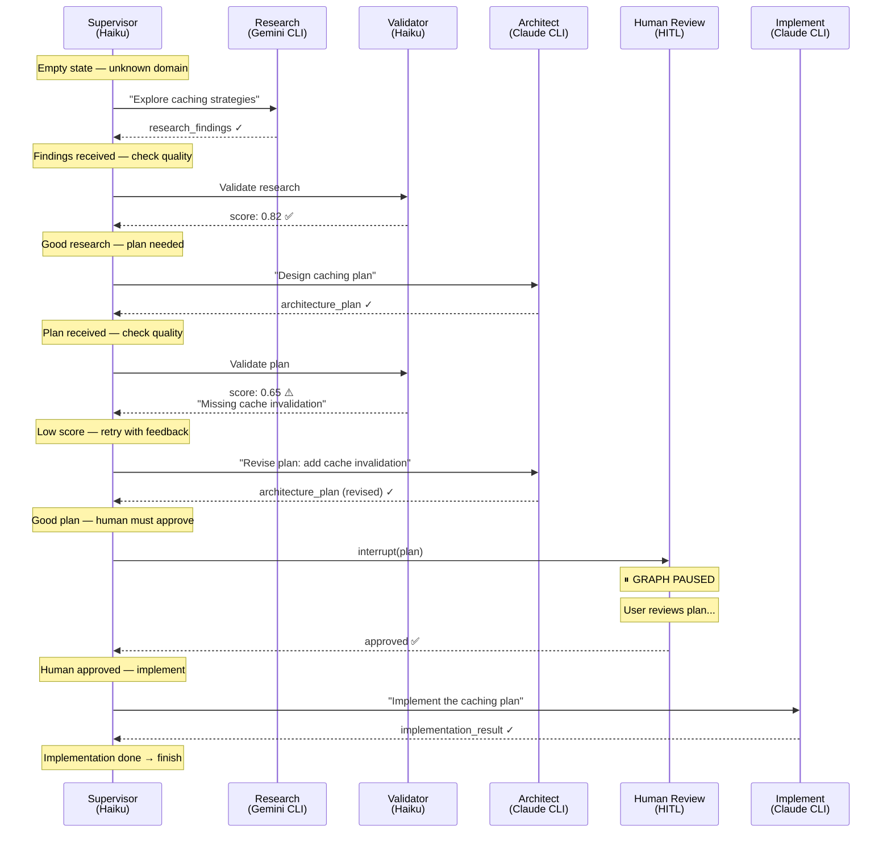
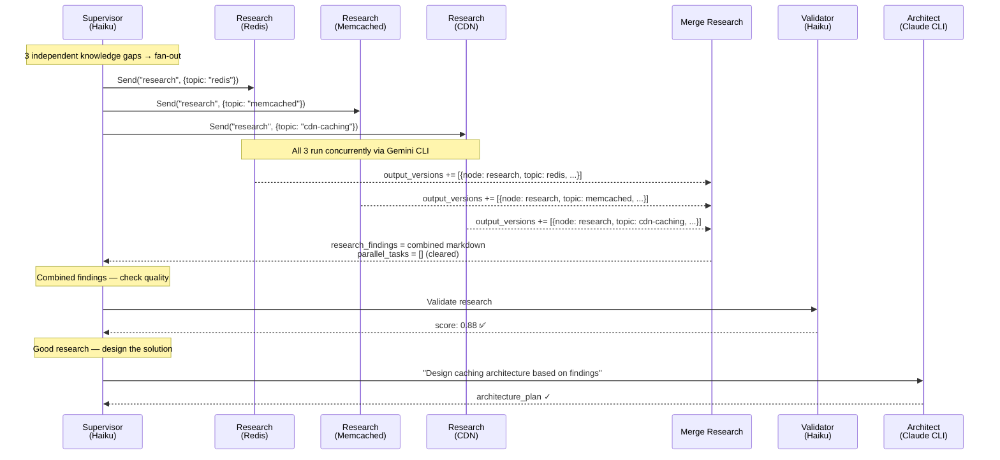

# LangGraph Orchestrator (Option B) — Architecture Guide

## Overview

The LangGraph orchestrator is a **Dynamic Supervisor** pipeline built on LangGraph's `StateGraph`. It uses a hub-and-spoke architecture where a central supervisor node inspects the full state after every step and decides what to do next.

v0.5 adds:
- **Fan-out/fan-in**: supervisor dispatches parallel research via `Send()`
- **Human-in-the-loop**: graph pauses for human approval before implementation

### Sequential Mode (default)



### Fan-Out Mode (parallel research)



**Entry point:** `ai-orchestrator-graph` (defined in `pyproject.toml`)

**MCP server:** `src/orchestrator/server.py` — exposes 6 tools over stdio

---

## Source Files

| File | Purpose |
|------|---------|
| `src/orchestrator/server.py` | MCP server — 7 tools: `research`, `architect`, `classify`, `chain`, `approve`, `history`, `rewind` |
| `src/orchestrator/graph.py` | Builds and compiles the StateGraph with InMemorySaver checkpointer |
| `src/orchestrator/state.py` | `OrchestratorState` TypedDict — shared state flowing through the graph |
| `src/orchestrator/nodes/supervisor.py` | Central decision-maker with Pydantic structured output (`RouterDecision`) |
| `src/orchestrator/nodes/validator.py` | Quality scoring (0.0–1.0) using Haiku |
| `src/orchestrator/nodes/research.py` | Gemini CLI deep research |
| `src/orchestrator/nodes/architect.py` | Claude CLI architecture/planning with self-correction |
| `src/orchestrator/nodes/human_review.py` | HITL node — pauses graph via `interrupt()` for human approval |
| `src/orchestrator/nodes/implement.py` | Claude CLI code implementation |
| `src/orchestrator/config.py` | YAML config loader with Pydantic models and sensible defaults |
| `src/orchestrator/models.py` | LangChain model factories (`get_classify_model`, etc.) |
| `src/orchestrator/router.py` | Role → provider resolution for the `classify` tool |
| `src/orchestrator/prompts/` | System prompts for research, architect, classifier roles |

---

## State Schema

Defined in `src/orchestrator/state.py` as `OrchestratorState(TypedDict)`:

```python
# Input
task: str                    # User's task description
context: str                 # Optional user-provided context

# Chat history (accumulates via add_messages reducer)
messages: Annotated[list[AnyMessage], add_messages]

# Domain outputs — latest (last-writer-wins)
research_findings: str       # Markdown from research node
architecture_plan: str       # Markdown from architect node
implementation_result: str   # Output from implement node

# Output versioning — append reducer (accumulates across attempts/timelines)
output_versions: Annotated[list[dict], operator.add]
# Each entry: {"node": "research|architect|implement", "attempt": N, "content": "..."}

# Supervisor (v0.4)
next_node: str               # Which node to call next
supervisor_rationale: str    # Why that node was chosen
supervisor_instructions: str # Instructions for the next node
history: list[str]           # Step-by-step audit trail
node_calls: dict[str, int]  # Call counts per node

# Fan-out (v0.5)
parallel_tasks: list[dict[str, str]]  # Sub-tasks for parallel research
parallel_task_topic: str              # Topic label for a Send() branch

# Human-in-the-loop (v0.5)
human_review_status: str              # "pending", "approved", or "rejected"
human_feedback: str                   # Feedback from human reviewer

# Validation
validation_score: float      # 0.0–1.0 quality score
validation_feedback: str     # Actionable feedback if score is low
```

All fields are optional (`total=False`). Nodes read what they need and write what they produce.

**Reducer strategy:**
- `messages` — `add_messages` reducer (chat history accumulates)
- `output_versions` — `operator.add` reducer (version history accumulates)
- Everything else — last-writer-wins (simple overwrite)

The dual approach (`research_findings` + `output_versions`) means consumers read the simple `str` for the latest output, while `output_versions` preserves every version for timeline comparison during `rewind()`.

---

## Graph Wiring

Built in `src/orchestrator/graph.py` → `build_orchestrator_graph(config)`:

1. **Nodes** are registered: `supervisor`, `research`, `architect`, `implement`, `validator`, `merge_research`, `human_review`
2. **Entry edge:** `START → supervisor` (supervisor always makes the first decision)
3. **Conditional edges from supervisor:** `select_next_node(state)` reads `state["next_node"]`
   - Sequential: routes to `research`, `architect`, `implement`, `validator`, or `END`
   - Fan-out: if `parallel_tasks` is populated and `next_node` is `"research"`, returns a list of `Send("research", payload)` objects
4. **Research exit:** conditional edge via `_research_exit(state)`
   - If `parallel_tasks` exists → routes to `merge_research`
   - Otherwise → routes back to `supervisor`
5. **merge_research → supervisor:** fixed edge, always returns to supervisor after combining results
6. **Checkpointer:** `InMemorySaver` (module-level singleton) enables thread-based state persistence

```python
graph.add_edge(START, "supervisor")

# Supervisor routes dynamically (may return Send() list for fan-out)
graph.add_conditional_edges("supervisor", select_next_node, {
    "research": "research",
    "architect": "architect",
    "human_review": "human_review",
    "implement": "implement",
    "validator": "validator",
    END: END,
})

# Research → conditional: fan-out goes to merge, sequential goes to supervisor
graph.add_conditional_edges("research", _research_exit, {
    "merge_research": "merge_research",
    "supervisor": "supervisor",
})

graph.add_edge("merge_research", "supervisor")
graph.add_edge("human_review", "supervisor")
graph.add_edge("architect", "supervisor")
graph.add_edge("implement", "supervisor")
graph.add_edge("validator", "supervisor")
```

---

## Nodes in Detail

### Supervisor (`nodes/supervisor.py`)

The brain of the pipeline. Uses a cheap/fast API model (Haiku) with **Pydantic structured output**.

**Input:** Full state summary (task, history, node call counts, truncated outputs, validation results)

**Output:** `RouterDecision` — a Pydantic model with:
- `next_step`: `"research" | "architect" | "implement" | "validator" | "finish"`
- `rationale`: One sentence explaining the decision
- `instructions`: Concrete instructions for the next node
- `parallel_tasks`: Optional list of `ParallelTask(topic, instructions)` for fan-out research

**Decision rules (from system prompt):**
1. Unknown domains → research first
2. Tasks needing design → architect (optionally after research)
3. Simple/clear tasks → architect first, then human_review, then implement
4. After research or architect → validate output quality
5. Low validation score → retry the node with feedback
6. After architect is validated → ALWAYS route to `human_review`
7. After `human_review` approved → route to implement
8. After `human_review` rejected → route back to architect with human feedback
9. After implement → finish (never validate implementation)
10. Max 3 calls per node
11. If stuck → finish with what you have
12. For 2-4 independent knowledge gaps → fan-out parallel research

### Validator (`nodes/validator.py`)

Scores the most recent output (architecture plan or research findings) on four criteria, each worth 0.25:

| Criterion | What it measures |
|-----------|-----------------|
| Completeness | Does it address the full task scope? |
| Specificity | Concrete details — file paths, function names, patterns? |
| Actionability | Can someone act on it without follow-up questions? |
| Accuracy | No hallucinations, vague hand-waving, or generic advice? |

Returns JSON `{score: 0.0-1.0, feedback: "..."}`. The supervisor reads this to decide whether to retry or proceed.

### Research (`nodes/research.py`)

Shells out to **Gemini CLI** for deep domain/technology exploration. Incorporates supervisor instructions and any previous validation feedback in the prompt. Timeout: 600s.

Works in two modes:
- **Sequential:** called normally with the full `OrchestratorState`
- **Parallel:** called via `Send()` with a partial payload (`task`, `context`, `supervisor_instructions`, `parallel_task_topic`, `validation_feedback`). The topic label is prepended to instructions so each branch focuses on its sub-task.

### Human Review (`nodes/human_review.py`)

HITL gate that pauses the graph before implementation. Uses LangGraph's `interrupt()` to halt execution and surface the architecture plan to the caller.

**Interrupt/resume cycle:**
1. Node runs, calls `interrupt(review_payload)` — graph pauses
2. MCP `chain()` tool detects the pause, returns the plan with approval instructions
3. User calls `approve(thread_id)` or `approve(thread_id, feedback="...")`
4. `approve()` sends `Command(resume={"decision": "approved/rejected", ...})`
5. Node re-executes, `interrupt()` returns the resume value
6. Node writes `human_review_status` and `human_feedback` to state
7. Supervisor reads the review result — routes to implement (approved) or architect (rejected)

### Merge Research (`graph.py` → `_merge_research_node`)

Fan-in node that runs after all parallel research branches complete. Reads `output_versions` to find entries matching the current `parallel_tasks` topics, synthesizes them into sectioned markdown (one `### topic` section per branch), writes the combined result to `research_findings`, and clears `parallel_tasks` to prevent re-triggering.

### Architect (`nodes/architect.py`)

Shells out to **Claude Code CLI** for design and planning. Includes a **self-correction** step: the prompt instructs Claude to verify that every file path and function name referenced actually exists in the codebase.

Incorporates: research findings, supervisor instructions, validation feedback. Timeout: 600s.

### Implement (`nodes/implement.py`)

Shells out to **Claude Code CLI** with full read/write codebase access. Takes the architecture plan and supervisor instructions. Has its own `IMPLEMENT_SYSTEM_PROMPT` defined in-file. Timeout: 600s.

---

## MCP Tools

The server (`src/orchestrator/server.py`) exposes 7 tools:

### Direct Tools

| Tool | What it does |
|------|-------------|
| `research(question, context?)` | Gemini CLI research — bypasses the graph |
| `architect(goal, context?, constraints?)` | Claude CLI architecture — bypasses the graph |
| `classify(task_description)` | Fast tier classification via API (Haiku) |

### Graph Tools

| Tool | What it does |
|------|-------------|
| `chain(task_description, context?, thread_id?)` | Full pipeline — pauses for human approval before implementation |
| `approve(thread_id, feedback?)` | Resume a paused chain — approve (no feedback) or reject (with feedback) |
| `history(thread_id, limit?)` | Show checkpoint history for a thread — supervisor decisions, validation scores, state at each step |
| `rewind(thread_id, checkpoint_id, new_task?)` | Time-travel — rewind to a checkpoint and re-run from that point, optionally with a new task |

### chain() Flow

1. Generates a `thread_id` (UUID) if not provided
2. Creates initial state: `{task, context}`
3. Invokes the compiled graph with checkpointer config
4. If graph pauses at `human_review` → returns the plan with approval instructions
5. If graph completes → returns formatted result with supervisor journey, quality scores, and domain outputs

### approve() — Human Review Response

1. Checks the graph is actually paused at `human_review`
2. Sends `Command(resume={"decision": "approved/rejected", "feedback": "..."})` to resume
3. If approved → graph continues through implement → finish
4. If rejected → supervisor routes back to architect with your feedback
5. If architect revises and hits another review → returns the new plan for re-approval

### history() + rewind() — Time Travel

Every graph invocation creates checkpoints (via `InMemorySaver`). You can:

1. Call `history(thread_id)` to see all checkpoints with their step number, source, state contents, supervisor decisions, and validation scores
2. Call `rewind(thread_id, checkpoint_id)` to restore a checkpoint and re-run the graph from that point
3. Optionally pass `new_task` to change direction on the re-run

---

## Configuration

### Config Loading (`config.py`)

Searches in order:
1. Explicit path argument
2. `./config.yaml` (project root)
3. `~/.config/ai-orchestrator/config.yaml`
4. Falls back to sensible defaults

### Default Roles

| Role | Provider | Model |
|------|----------|-------|
| research | Google | `gemini-2.0-pro` |
| architect | Anthropic | `claude-sonnet-4` |
| classify | Anthropic | `claude-haiku-4-5` (max 256 tokens) |

The **supervisor** and **validator** nodes both use the classify model (Haiku) — cheap and fast for routing decisions and quality scoring.

### API Keys

Set in `.env` at the project root (loaded via `python-dotenv` at server startup):

```
ANTHROPIC_API_KEY=sk-...
GOOGLE_AI_API_KEY=AI...
```

---

## Model Usage

| Component | Model | How it's called |
|-----------|-------|-----------------|
| Supervisor | Haiku (API) | `model.with_structured_output(RouterDecision)` — Pydantic structured output |
| Validator | Haiku (API) | `model.ainvoke(messages)` — JSON response parsed manually |
| Research | Gemini (CLI) | `run_gemini(prompt, timeout=600)` — subprocess |
| Architect | Claude (CLI) | `run_claude(prompt, timeout=600)` — subprocess |
| Implement | Claude (CLI) | `run_claude(prompt, timeout=600)` — subprocess |
| Classify | Haiku (API) | Via `Router.classify()` — JSON response |

Key distinction: **Supervisor/Validator use lightweight API calls** (fast, cheap). **Domain nodes use CLI subprocesses** (full codebase access, tool use, longer-running).

---

## Shared Code with Option A

Both Option A (`cli_server.py`) and Option B (`server.py`) share:

- `cli_server_pkg/session/runners.py` — `run_claude()` and `run_gemini()` subprocess wrappers
- `cli_server_pkg/helpers/prompts.py` — `build_prompt()` utility
- `src/orchestrator/prompts/` — system prompts for research and architect roles

This ensures consistent CLI behavior across both options.

---

## Testing

### Run the MCP server directly

```bash
cd /path/to/ai-orchestrator
python -m src.orchestrator.server
```

### Test with MCP Inspector

```bash
npx @modelcontextprotocol/inspector uv run ai-orchestrator-graph
```

### Test individual tools via Python

```python
import asyncio
from src.orchestrator.server import research, architect, classify, chain

# Direct research
result = asyncio.run(research("How does React Server Components work?"))

# Full pipeline
result = asyncio.run(chain("Add error handling to the API routes"))

# With thread continuation
result = asyncio.run(chain("Now add tests for those error handlers", thread_id="<thread-id-from-above>"))
```

### Time-travel test

```python
from src.orchestrator.server import chain, history, rewind

# Run a chain
result = asyncio.run(chain("Refactor the auth module"))
# Extract thread_id from result

# View checkpoints
h = asyncio.run(history("<thread-id>"))

# Rewind to a checkpoint and retry with different instructions
r = asyncio.run(rewind("<thread-id>", "<checkpoint-id>", "Refactor auth but keep backward compatibility"))
```

---

## Data Flow Example

A typical `chain("Add caching to the API")` execution:



The `history` list in state captures every decision, creating a full audit trail.

---

## Fan-Out Data Flow Example

A `chain("Evaluate caching options for our API — Redis vs Memcached vs CDN")` with parallel research:



**How `Send()` works:** Each `Send("research", payload)` dispatches the same `research` node with a different input dict. LangGraph runs them concurrently. Each branch writes to `output_versions` (append reducer accumulates all results). The `_research_exit` conditional edge routes all branches to `merge_research`, which combines them into `research_findings` before returning to the supervisor.
