# LangGraph Graph Patterns

A reference of established multi-agent graph patterns, how they work, and how they relate to this orchestrator.

---

## Table of Contents

1. [Hub-and-Spoke (current)](#1-hub-and-spoke-current)
2. [Linear Pipeline](#2-linear-pipeline)
3. [DAG (Directed Acyclic Graph)](#3-dag-directed-acyclic-graph)
4. [Hierarchical / Nested Graphs](#4-hierarchical--nested-graphs)
5. [Network / Mesh](#5-network--mesh)
6. [Map-Reduce](#6-map-reduce)
7. [Competitive / Tournament](#7-competitive--tournament)
8. [Reflection Loop (tight)](#8-reflection-loop-tight)
9. [Human-in-the-Loop (HITL)](#9-human-in-the-loop-hitl)
10. [What This Project Uses](#10-what-this-project-uses)
11. [Natural Next Steps](#11-natural-next-steps)

---

## 1. Hub-and-Spoke (current)

A central supervisor makes every routing decision. Nodes never talk to each other directly — all communication goes through the hub.

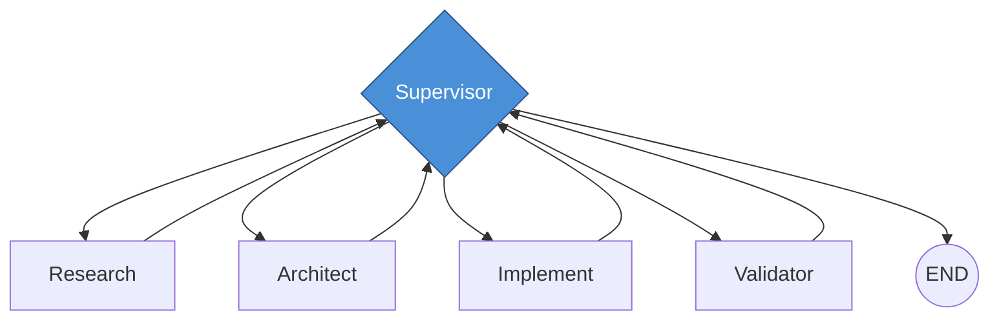

**How it works:** The supervisor inspects the full state after every node execution and decides what to do next — call another node, retry with feedback, or terminate.

**Strengths:**
- Full control — supervisor sees the complete picture at every decision point
- Easy to debug — every routing decision is logged with rationale
- Flexible — can skip nodes, reorder them, retry with different instructions
- Adding a new node just means registering it and updating the routing schema

**Weaknesses:**
- Sequential bottleneck — supervisor runs between every step, adding latency
- Single point of failure — if the supervisor makes a bad routing decision, the entire pipeline goes off track
- Cost — supervisor model is called N+1 times for N node executions

**When to use:** When the workflow is dynamic and the next step depends on the result of the previous step. When you need a global view for decision-making.

---

## 2. Linear Pipeline

Fixed sequence of steps. No decision-making between nodes.

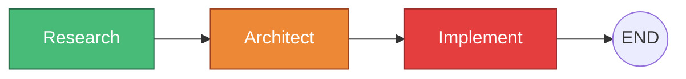

**How it works:** Each node runs in order, passing state to the next. No branching, no skipping.

**Strengths:**
- Simple — easy to understand, build, and debug
- Predictable — you always know what runs when
- Low overhead — no routing model needed

**Weaknesses:**
- Can't skip steps — simple tasks still run the full pipeline
- Can't retry a single step — failure means re-running everything
- Can't adapt — if research reveals the task is simpler than expected, architect still runs

**When to use:** When every task needs the same sequence of steps. Good for well-defined workflows like CI/CD pipelines.

**In this project:** v0.3 was a linear pipeline (`classify → research → critique → architect → critique → implement`). Replaced by hub-and-spoke in v0.4 because the fixed ordering was too rigid.

---

## 3. DAG (Directed Acyclic Graph)

Pre-defined parallel paths that converge at known join points. No cycles — data flows in one direction.

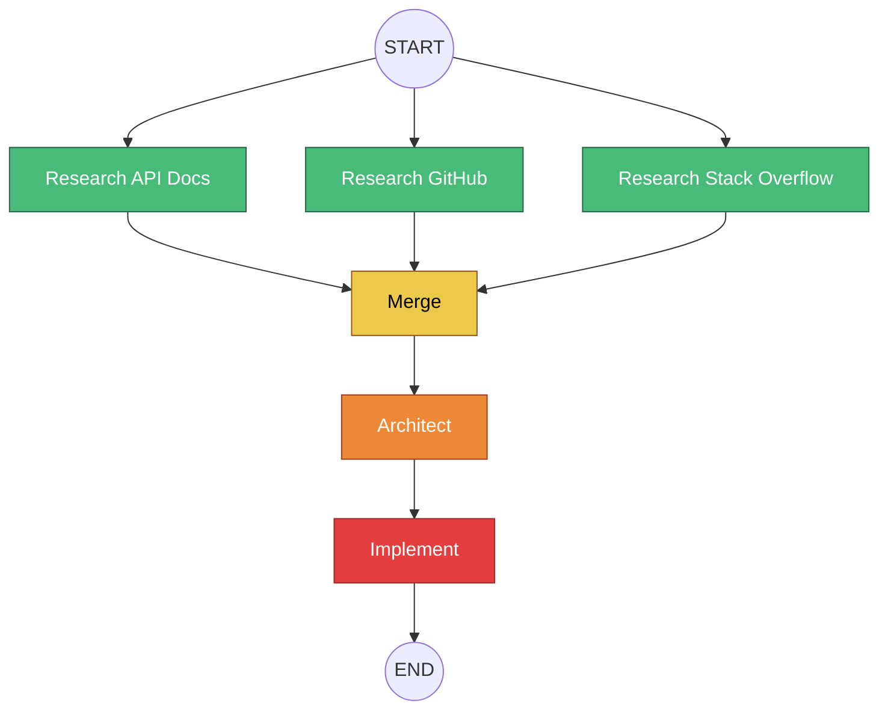

**How it works:** The graph topology is defined at build time. Multiple nodes run in parallel where edges allow it. A merge/join node waits for all upstream branches before proceeding.

**Strengths:**
- True parallelism across different node types (not just instances of one node)
- Deterministic — the same graph always runs the same way
- Easy to visualize and reason about

**Weaknesses:**
- Topology is fixed at build time — can't decide at runtime to skip a branch
- No cycles — can't retry a node without rebuilding the graph
- Adding a branch means changing the graph structure

**When to use:** When you know the execution shape ahead of time and want maximum parallelism. ETL pipelines, data processing, batch workflows.

**Difference from fan-out:** Fan-out (using `Send()`) dynamically spawns N instances of the same node at runtime. A DAG has fixed, pre-registered parallel nodes. DAGs are more rigid but support different node types in parallel.

---

## 4. Hierarchical / Nested Graphs

Supervisors managing sub-supervisors. Each sub-graph is a self-contained pipeline with its own state and decision-making.

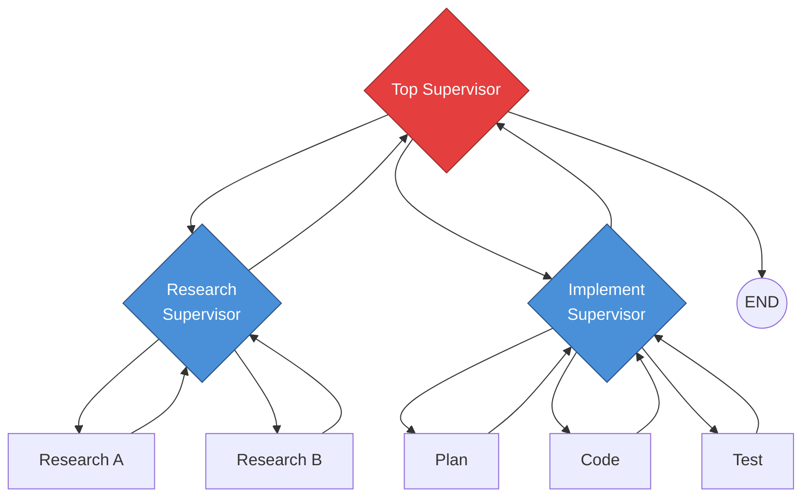

**How it works:** The top-level supervisor delegates to specialized sub-supervisors. Each sub-supervisor manages its own domain — research supervisor handles research strategy, implementation supervisor handles code/test/review cycles. Sub-graphs have their own state, checkpointers, and decision logic.

In LangGraph, this is implemented with **subgraphs** — a compiled graph used as a node inside another graph. The parent graph invokes the subgraph node, which runs its full internal pipeline, and returns a result to the parent.

**Strengths:**
- Scales to complex workflows — each sub-supervisor is specialized
- Separation of concerns — research strategy is independent of implementation strategy
- Reusable sub-graphs — the implementation sub-graph could be used in other pipelines
- Each level can use a different model (Haiku for top routing, Sonnet for implementation decisions)

**Weaknesses:**
- More moving parts — harder to debug, more models to configure
- Latency from nested decision-making — sub-supervisors add their own routing overhead
- State mapping — parent and child graphs may have different state schemas, requiring explicit input/output mapping

**When to use:** When your workflow has distinct phases that each require their own internal decision-making. When a single supervisor prompt would be too complex to handle all the routing logic.

---

## 5. Network / Mesh

Nodes can call each other directly. No central coordinator. Each node decides who to hand off to next.

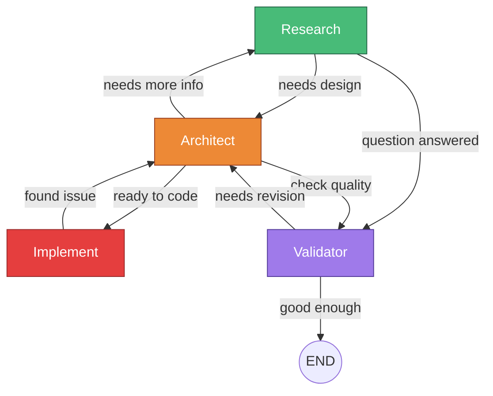

**How it works:** Every node has conditional edges to multiple other nodes. After executing, each node inspects the state and decides where to route next. There's no single decision-maker — routing logic is distributed across all nodes.

In LangGraph, this means `add_conditional_edges` on every node, with each node's routing function making its own decision.

**Strengths:**
- Flexible — can model complex back-and-forth (architect asks research a follow-up question mid-planning)
- Low latency — no supervisor call between every step
- Natural for conversational workflows where agents negotiate

**Weaknesses:**
- Hard to reason about — no single place to see the full execution flow
- Can loop forever — without careful termination logic, nodes can ping-pong indefinitely
- Debugging is painful — "why did architect call research 5 times?"
- No global view — each node only sees its local state, no one has the full picture

**When to use:** Rarely. Best for truly peer-to-peer agent communication where no single agent should have authority. Research prototypes, creative brainstorming between agents.

**Why we don't use this:** The supervisor pattern gives you the same flexibility (any node can follow any node) with the added benefit of centralized decision-making and a clear audit trail.

---

## 6. Map-Reduce

Dynamically spawn N workers for the same task on different inputs, then reduce (combine) results. A generalization of fan-out/fan-in.

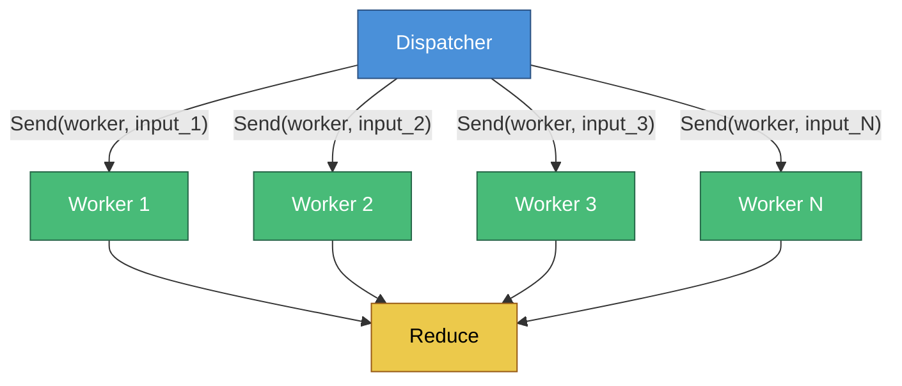

**How it works:** A dispatcher determines what work needs to be done and splits it into N independent sub-tasks. Each sub-task is dispatched to the same worker node via `Send()`. All workers run concurrently. A reduce node collects all results and combines them.

In LangGraph, the dispatcher is your routing function (returns a list of `Send()` objects). The workers are a single registered node that receives different payloads. The reduce node combines results using state reducers (`operator.add`) and/or a dedicated merge node.

**Strengths:**
- Scales to arbitrary N — process 3 topics or 300
- Maximum parallelism — wall-clock time is `max(worker_times)` not `sum(worker_times)`
- Simple mental model — same operation applied to many inputs

**Weaknesses:**
- Stragglers — all workers must finish before reduce runs, one slow worker blocks everything
- No inter-worker communication — worker 2 can't use worker 1's findings
- Reduce can be complex — combining N heterogeneous outputs into a coherent whole

**When to use:** When you have N independent sub-tasks of the same type. Document processing, multi-source research, batch analysis, competitive evaluation.

**In this project:** Fan-out research is a specialized map-reduce — the supervisor is the dispatcher, research nodes are workers, `merge_research` is the reducer.

---

## 7. Competitive / Tournament

Run the same task through multiple models or strategies in parallel, then judge which result is best.

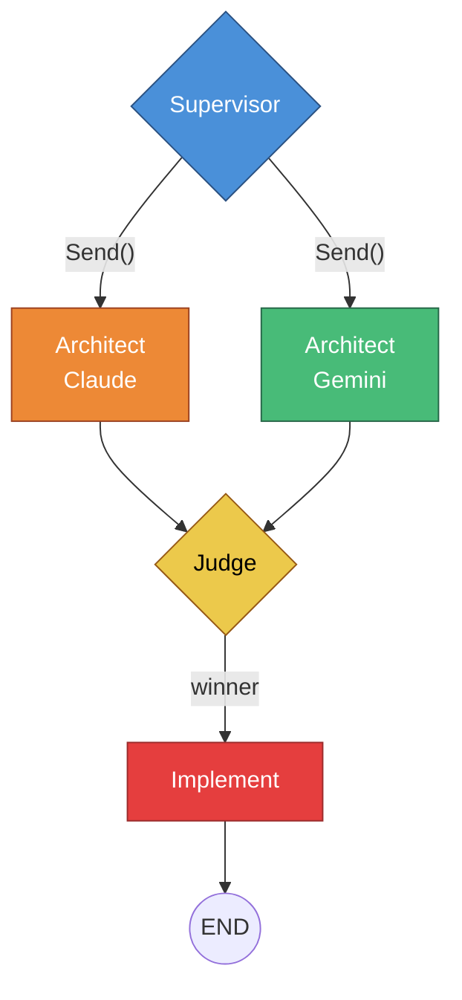

**How it works:** The same prompt is sent to multiple models (or the same model with different temperatures/system prompts). A judge node evaluates all outputs and picks the winner. Only the winning output proceeds to the next step.

This uses the same `Send()` mechanism as map-reduce, but the "workers" are different models/strategies rather than the same model on different inputs. The "reducer" is a judge that selects rather than combines.

**Strengths:**
- Higher quality — best-of-N is statistically better than single-shot
- Model diversity — different models catch different things
- Useful for high-stakes decisions (architecture choices, security reviews)

**Weaknesses:**
- N times the cost — every competitor runs the full task
- N times the latency (compared to single-shot, though competitors run in parallel)
- Judge quality matters — a bad judge negates the benefit

**When to use:** When output quality matters more than cost. Architecture decisions, critical code paths, security-sensitive changes.

**How you'd build it:** Same `Send()` pattern as fan-out research, but targeting the architect node with different model configs in each payload. The judge would be a validator-style node that compares outputs instead of scoring a single one.

---

## 8. Reflection Loop (tight)

A single node paired with a critic in a tight two-node cycle. No supervisor involvement.

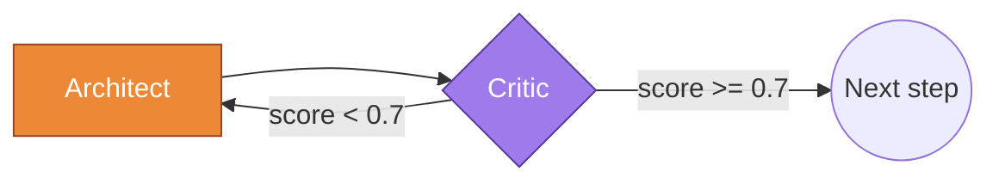

**How it works:** A node produces output, a critic evaluates it, and if the score is below a threshold, the node reruns with the critic's feedback. This repeats until the score is acceptable or a max-attempts limit is hit.

In LangGraph, this is a conditional edge from the critic back to the producer node, with a counter in state to prevent infinite loops.

**Strengths:**
- Fast iteration — no supervisor overhead between attempts
- Focused — critic is specialized for evaluating one type of output
- Simple to implement — just two nodes and a conditional edge

**Weaknesses:**
- No global view — the critic only sees this node's output, not the full pipeline context
- Can't change strategy — if the output is fundamentally wrong, retrying with feedback won't fix it
- The supervisor pattern does this better — it has full state visibility and can decide to route to a different node instead of retrying

**When to use:** When you want cheap, fast iteration on a single step without the overhead of a full supervisor loop. Good for code formatting, grammar checking, structured output validation.

**In this project:** v0.3 used dedicated critique nodes in tight loops with research and architect. Replaced in v0.4 by the supervisor + validator pattern, which gives the same retry capability but with better decision-making (the supervisor can choose to retry, skip, or try a completely different approach).

---

## 9. Human-in-the-Loop (HITL)

The graph pauses at a designated point and waits for human input before continuing. The human can approve, reject, or modify the current state.

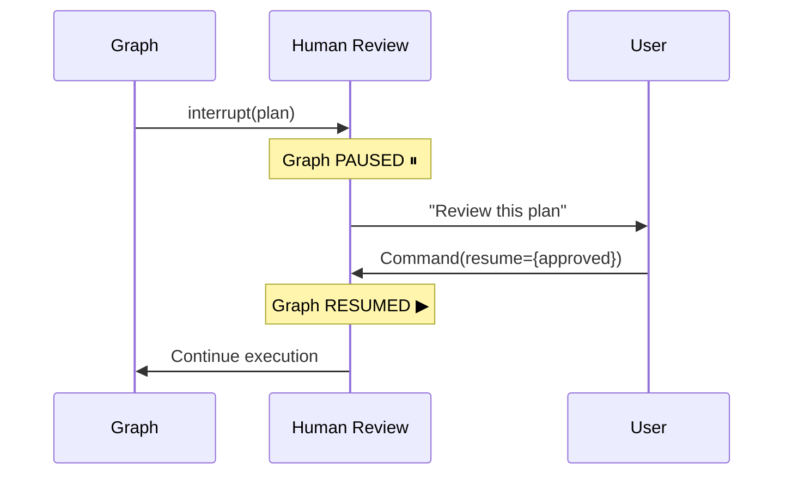

**How it works in LangGraph:** A node calls `interrupt(value)` which raises a `GraphInterrupt` exception. The graph execution stops and the interrupt value is returned to the caller. To resume, the caller invokes the graph with `Command(resume=response_value)`. The node re-executes from the top, and `interrupt()` returns the resume value instead of raising.

**Key requirement:** A checkpointer must be enabled — the graph state is saved at the interrupt point so it can be restored on resume.

**Strengths:**
- Safety gate — prevents autonomous systems from taking irreversible actions
- Human judgment — the human can inject domain knowledge the AI doesn't have
- Feedback loop — rejection with feedback lets the AI revise based on human input
- Audit trail — the review decision is recorded in state

**Weaknesses:**
- Latency — the pipeline blocks until the human responds (could be minutes or hours)
- UX complexity — the caller (MCP tool, API) needs to handle the paused state and expose an approval mechanism
- Re-execution — the node re-executes from the top on resume, so any work before the `interrupt()` call runs twice

**When to use:** Before any irreversible action (code implementation, deployment, sending messages). When the cost of an incorrect autonomous action is high.

**In this project:** The `human_review` node pauses after the architecture plan is validated. The `approve()` MCP tool resumes with approval or rejection + feedback. The supervisor routes to implement (approved) or back to architect (rejected).

---

## 10. What This Project Uses

The orchestrator combines three patterns:

### Hub-and-Spoke (primary)

The supervisor is the central hub. All routing decisions flow through it. Every domain node returns to the supervisor after execution.

### Map-Reduce (for parallel research)

When the supervisor identifies 2-4 independent knowledge gaps, it fans out via `Send()` to multiple research instances, then `merge_research` combines the results. This is embedded within the hub-and-spoke — the supervisor triggers the fan-out, and after the merge, control returns to the supervisor.

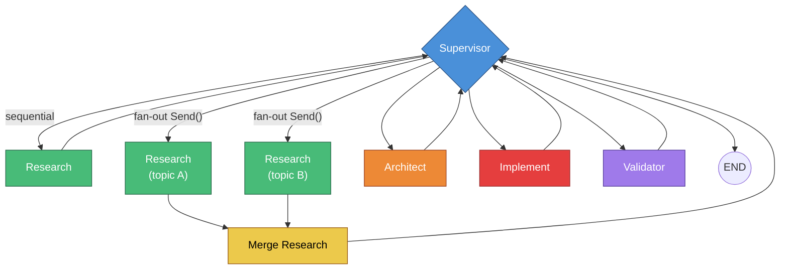

The supervisor decides at runtime whether to use sequential research (single topic) or fan-out research (multiple topics). The graph supports both paths — `_research_exit` routes to `merge_research` or back to `supervisor` based on whether `parallel_tasks` is populated.

### Human-in-the-Loop (safety gate)

Before any implementation, the graph pauses at the `human_review` node for approval. The MCP `approve()` tool resumes with the human's decision. Rejection sends the architect back to revise with feedback.

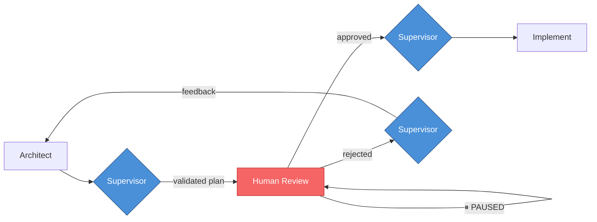

---

## 11. Natural Next Steps

Patterns that would build on the current architecture without replacing it:

### Hierarchical Implementation (Pattern 4)

Give the implement node its own sub-graph with an implementation supervisor managing `plan → code → test → review` steps. The top-level supervisor just says "implement" and gets back a result.

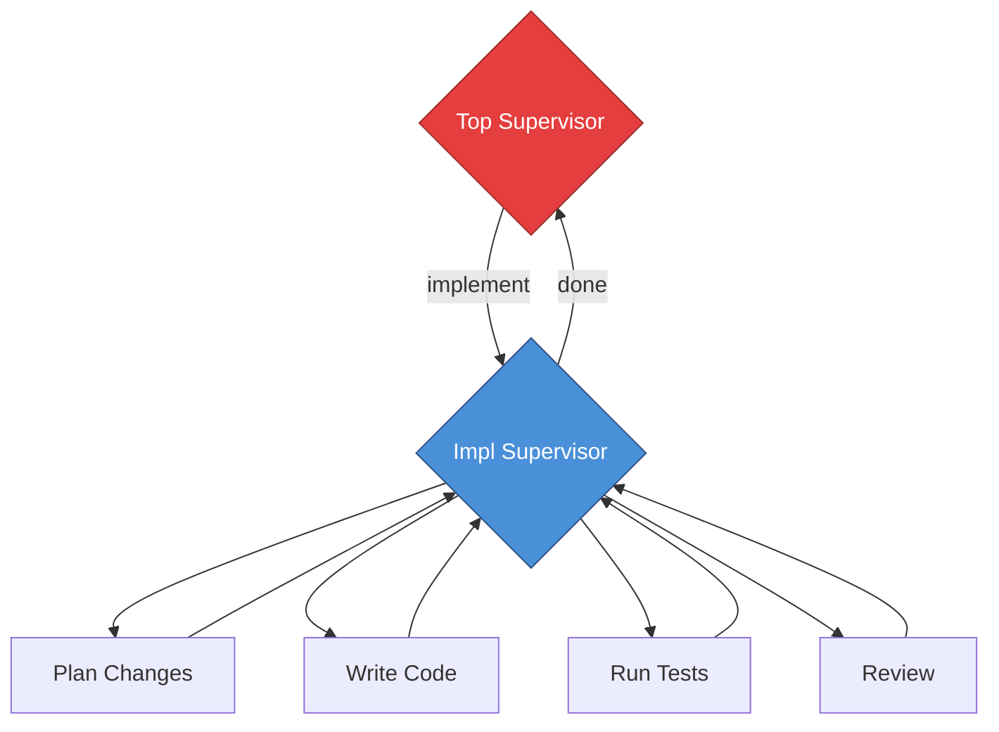

**What it gives you:** The implementation phase becomes more than a single CLI call. The sub-supervisor can run tests, review its own code, and fix issues before returning to the top-level supervisor. Currently, implementation is a single `run_claude()` call — if it produces bad code, the top supervisor has no way to iterate on it (it doesn't validate after implement).

### Competitive Architecture (Pattern 7)

Run the architect node through both Claude and Gemini in parallel, have the validator compare and pick the better plan.

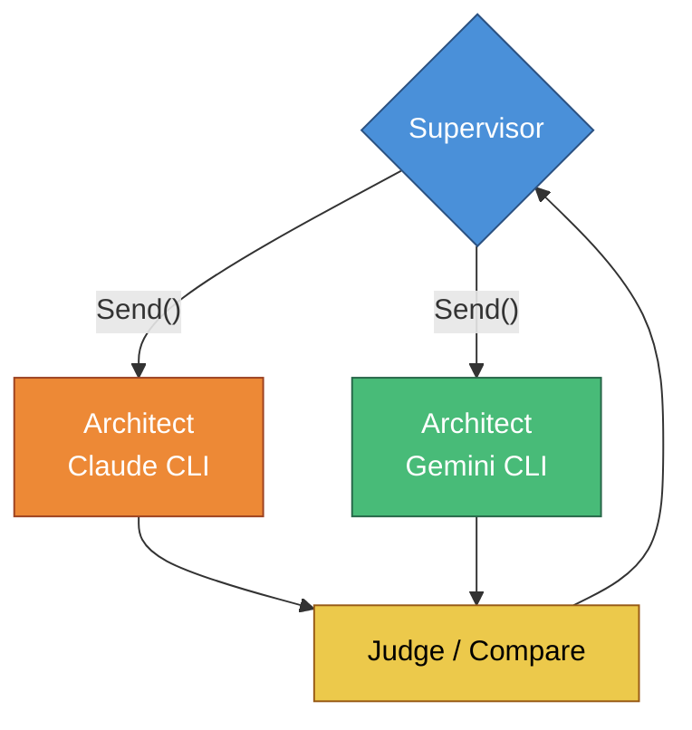

**What it gives you:** Different models have different design philosophies. Claude might produce a more conservative plan while Gemini might suggest a more novel approach. The judge picks the better one — or synthesizes the best parts of both.

**Implementation:** Same `Send()` mechanism as fan-out research. The architect node would need to accept a model hint in the payload so each branch uses a different CLI. A `merge_architect` or `judge_architect` node would compare outputs.

Both of these build on the existing hub-and-spoke + map-reduce foundation. The core supervisor loop stays the same — you're just making individual nodes smarter internally.
